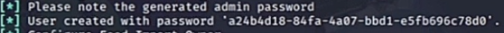
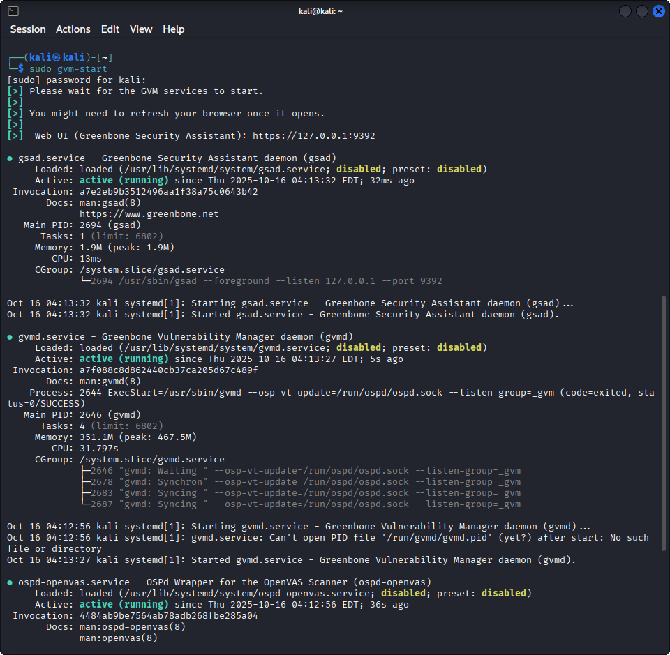
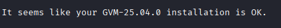
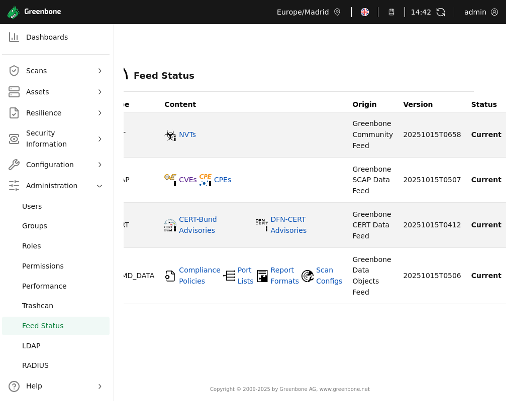
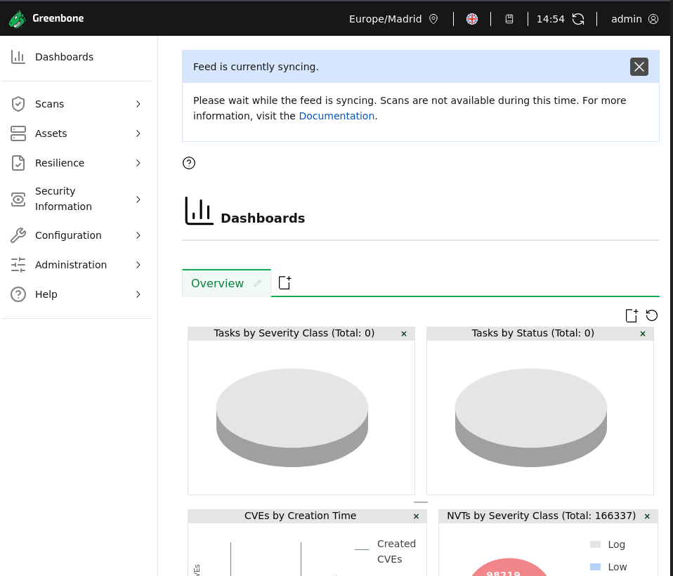
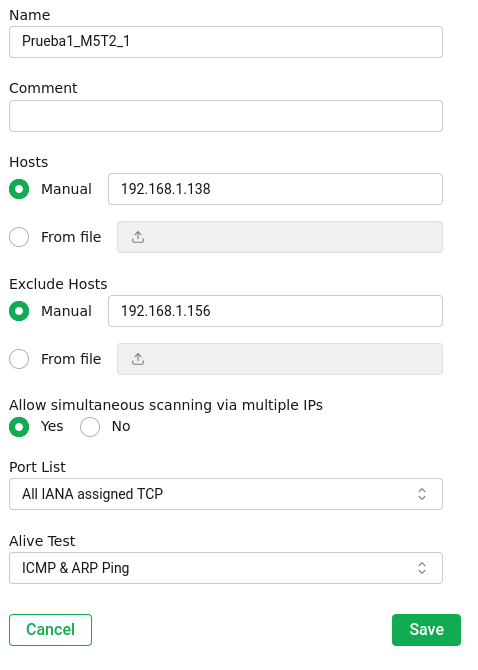
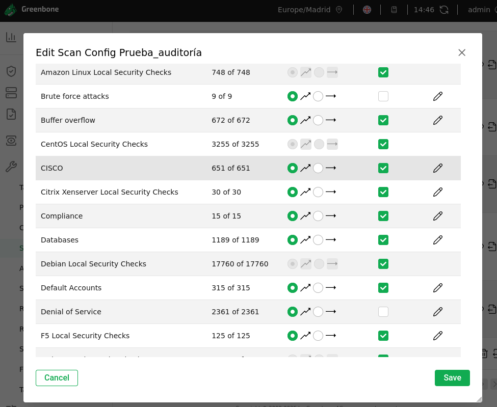
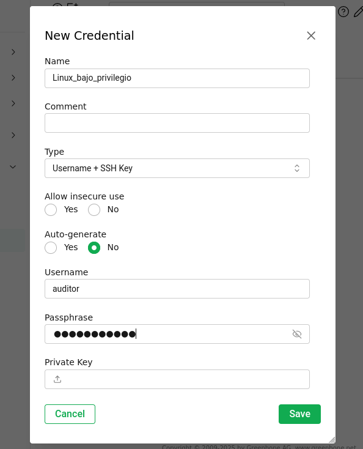
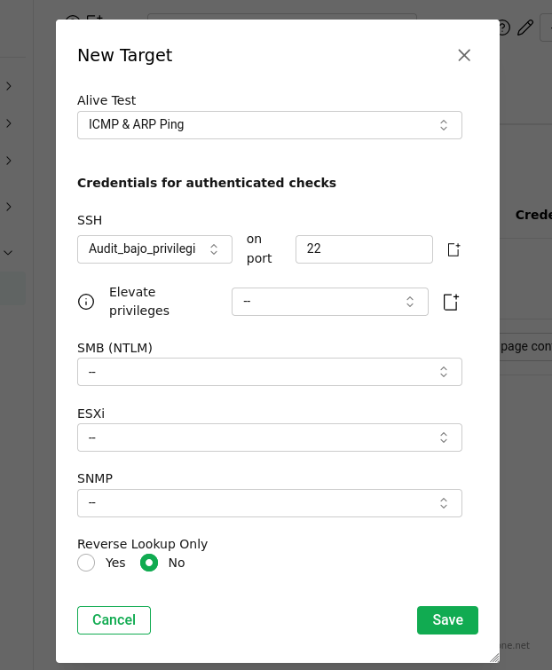

## Greenbone OpenVas: Guía Avanzada de Operación y Priorización

## Resumen del proyecto

Este repositorio contiene un **recurso técnico profesional** que va más alla de la documentación básica de **Greenbone Vulnerability Management (GVM)**, anteriormente conocido como OpenVAS.

El objetivo de esta guía es proporcionar a analistas un **flujo de trabajo optimizado, eficiente y orientado al criterio técnico** que abarca desde la preparación del entorno hasta el análisis y priorización (triage) de resultados. Este recurso servirá como *portfolio* que demuestra experiencia práctica en la *Gestión del Ciclo de Vida de la Vulnerabilidad**

---

## Índice de Contenidos

1. [Introducción: GVM en el Arsenal del Analista](#1-introducción-gvm-en-el-arsenal-del-analista)
    1.1. ¿Por qué GVM y no solo Nmap/Metasploit?
    1.2. Propósito de esta guía: Criterio técnico y eficiencia
2. [Preparación e Instalación: Entorno Profesional](#2-preparación-e-instalación-entorno-profesional)
    2.1. Opciones de despliegue (El criterio del analista)
    2.2. Guía rápida de instalación/setup en Kali Linux
3. [Configuración y Creación de Tareas](#3-configuración-y-creación-de-tareas-tareas-clave)
    3.1. Gestión de targets: Segmentación y Exclusiones
    3.2. Perfiles de escaneo (Scan Configs): Optimización de tiempo
    3.3. Uso de credenciales (El escaneo autenticado obligatorio)
4. [Análisis y Priorización de Reportes](#4-análisis-y-priorización-de-reportes-el-valor-del-analista)
    4.1. Filtros y búsquedas avanzadas (CheatSheet)
    4.2. El proceso del triage y la gestión de falsos positivos
5. [Integración y Automatización con la API](#5-integración-y-automatización-con-la-api)
    5.1. Extracción de datos para reporting
    5.2. Automatización con 'gvm-tools

## 1. Introducción: GVM en el Arsenal del Analista

Este repositorio es un recurso técnico creado por analistas para analistas. Su objetivo es ir más allá de la documentación básica, proporcionando un **flujo de trabajo profesional, optimizado y orientado a resultados** para la gestión de vulnerabilidades utilizando la *suite* **Greenbone Vulnerability Management (GVM)**.

### 1.1. ¿Por Qué GVM y No Solo Nmap/Metasploit?

| Herramienta | Función Principal | Orientación | Valor Añadido de GVM |
| :--- | :--- | :--- | :--- |
| **Nmap** | Descubrimiento de red, mapeo de puertos y servicios. | Reducción de objetivos. | GVM va más allá con la prueba de vulnerabilidades específicas (NVT) y la auditoría. |
| **Metasploit** | Explotación de vulnerabilidades conocidas. | Prueba de concepto (PoC) activa. | GVM genera un **informe de auditoría** (referencias CVE/CVSS, solución) para informar la fase de explotación. |
| **GVM (OpenVAS)** | Escaneo no invasivo, gestión de *feeds* (NVT), reporte y *triage*. | Auditoría continua, *compliance* y gestión del riesgo. | GVM proporciona la **visión de auditoría completa** y la gestión del ciclo de vida de la vulnerabilidad. |

## 1.2. Propósito de Esta Guía: Criterio Técnico y Eficiencia

El valor del analista en un entorno de Vulnerability Management reside en:

1.  **Optimizar el Escaneo:** Reducir el tiempo y el "ruido" (falsos positivos) mediante la selección adecuada de perfiles de escaneo y credenciales.
2.  **Validar y Priorizar:** Aplicar el criterio técnico para diferenciar una vulnerabilidad *real* de un falso positivo, y priorizar la mitigación en función del **riesgo de negocio**, no solo de la severidad del CVSS.
3.  **Integrar:** Usar la API para automatizar tareas y conectar los resultados con otros sistemas (CMDB, *ticketing*).

---

## 2. Preparación e Instalación: Entorno Profesional

La instalación debe estar orientada a la **funcionalidad rápida** en un entorno de laboratorio o pruebas, pero es crucial entender las **limitaciones de escala** de este despliegue.

### 2.1. Opciones de Despliegue (El Criterio del Analista)

| Despliegue | Propósito Profesional | Limitaciones (Criterio Crítico) |
| :--- | :--- | :--- |
| **Kali Linux / VM (Opción de Guía)** | Ideal para **laboratorios personales, PoCs o pruebas de alcance muy limitado**. | **NO apta para escaneos grandes o continuos** debido al riesgo de inestabilidad y alto consumo de recursos. |
| **GCE Appliance / Docker** | **Vía recomendada para entornos de producción** o pruebas de gran escala y estabilidad. | Requiere infraestructura de servidor o máquina virtual dedicada con recursos suficientes. |

### 2.2. Guía Rápida de Instalación/Setup en Kali Linux

Utilizaremos los *repositorios* de Kali para una instalación ágil y la configuración del *setup*.

**Requisito Crítico:** Se recomienda un mínimo de **8 GB de RAM** dedicados a la VM de Kali para un rendimiento aceptable de GVM.

**Pasos de Configuración Inicial:**

1.  **Instalar el paquete de GVM:**

    ```bash
    sudo apt update
    sudo apt install openvas
    ```

2.  **Ejecutar el Setup Inicial y Creación de Usuario:**
    Este comando realiza la configuración inicial, crea la base de datos, inicia los servicios y descarga los *feeds*.

    ```bash
    # Ejecuta el asistente de configuración.
    sudo gvm-setup
    ```

    * **Nota Crítica:** El *setup* en Kali puede requerir pasos adicionales dependiendo de la versión. **Importante anotar la contraseña de usuario 'admin'generada automáticamente.**

    

3. **Gestión de Servicios (Control Operacional):**
Una vez instalado, hay que controlar el proceso en segundo plano.

    ```bash
    # Iniciar servicios de GVM
    sudo gvm-start
    
    # Detener servicios de GVM (necesario para mantenimiento o reinicios)
    sudo gvm-stop
    ```
    

4. **Verificación del Sistema:**
Comprobar que todos los servicios y *feeds* están sincronizados.

    ```bash
    sudo gvm-check-setup
    
    # IMPORTANTE: La sincronización de Feeds (NVT/SCAP/CERT) es el proceso más largo y puede tomar varias horas. No intentar escanear antes de que gvm-check-setup indique que los feeds están actualizados.
    ```

    
    

    ---
    
    ### ⚠️ Nota de Criterio: Fortificación del Servidor de Escaneo
    
    Debemos asegurar la seguridad de nuestras herramientas. El *output* de verificación suele emitir una advertencia que **debe ser corregida** en un entorno profesional:
    
    * **Advertencia:** `WARNING: Your password policy is empty.`
    * **Acción:** Se debe **editar el archivo `/etc/gvm/pwpolicy.conf`** para establecer una política de contraseñas fuerte y mitigar esta advertencia.

5. **Acceso Web:**
Acceda a la interfaz de GVM (Generalmente `https://127.0.0.1:9392/`).

    

---

## 3. Configuración y Creación de Tareas (Tareas Clave)

Aquí comienza la aplicación de criterio técnico para optimizar los escaneos.

### 3.1. Gestión de Targets: Segmentación y Exclusiones

Nunca se debe escanear a ciegas. La gestión de *Targets* es clave para la eficiencia y el cumplimiento de las políticas de escaneo.

* **Definición:** Definir los *Targets* por rango de IP, CIDR o subida de archivo.
* **¡Avanzado! Uso de Exclude Hosts:** Utilizar esta función para **evitar escanear activos críticos o sensibles** (p. ej., *firewalls* de producción, servidores de *backup*) que podrían ser inestables ante escaneos intensivos. Este es un paso de **responsabilidad crítica**.

    

### 3.2. Perfiles de Escaneo (Scan Configs): Optimización de Tiempo

La elección del perfil de escaneo define la velocidad, la intrusividad y la calidad del resultado. Evitar el perfil "Full and Fast" para auditorías serias.

| Perfil de Escaneo | ¿Cuándo Usarlo? | Lo que Abarca | Riesgo de Ruido (Falsos Positivos) |
| :--- | :--- | :--- | :--- |
| **Full and Fast** | Auditoría inicial en **entornos no críticos** (solo testeo rápido). | NVT públicos, sin *bruteforce*. | Medio. |
| **System Discovery** | **Antes** del escaneo principal, para mapeo. | Solo detección de puertos/servicios. | Bajo. |
| **Personalizado (El Camino Profesional)** | El **estándar de oro** para auditorías. | Solo familias de NVT específicas para el alcance (p. ej., solo *Web Application* o *Default Credentials*). | Mínimo. |

**Proceso de Creación de Scan Config Personalizado:**
Hay que enfocarse en la reducción de falsos positivos y la rapidez, **excluyendo manualmente familias de NVT intrusivas** (como *Denial of Service* o *Bruteforce*) que son lentas y pueden afectar la estabilidad del sistema objetivo.



### 3.3. Uso de Credenciales (El Escaneo Autenticado Obligatorio)

**Criterio de Analista:** Un escaneo **no autenticado** (de caja negra) solo encuentra vulnerabilidades de red. Un escaneo **autenticado** (SSH para Linux/SMB para Windows) es **obligatorio** para detectar:
* Parches faltantes del sistema operativo.
* Fallas de configuración internas (p. ej., directorios *web* accesibles, contraseñas predeterminadas).
* Configuraciones de *software* de servidor.

**Pasos Clave:** Asegurarse de que el usuario utilizado tenga **privilegios mínimos** necesarios para la auditoría (Principio de Menor Privilegio) y que los *plugins* de auditoría están habilitados en el *Scan Config*.





> **Escaneo Autenticado Obligatorio:** Se asigna la credencial de bajo privilegio en la sección **Credentials for authenticated checks** del Target. Esto habilita las comprobaciones internas. Se utilizó un Target **recién creado** para evitar *bugs* de la interfaz de GSA.

---

## 4. Análisis y Priorización de Reportes (El Valor del Analista)

El valor del analista no está en escanear, sino en **filtrar, validar y priorizar** los resultados.

### 4.1. Filtros y Búsquedas Avanzadas (CheatSheet)

Usar el lenguaje de filtro de GVM para ir más allá de la simple severidad CVSS.

```bash
# Filtrar vulnerabilidades críticas y con alta calidad de detección (QoD > 70%)
severity > 7.0 and qod > 70%

# Buscar un activo específico y una vulnerabilidad específica por OID
asset: "Web Servers" and nvt: OID_del_NVT

# Filtrar por vulnerabilidades críticas AÚN NO justificadas (sin override)
severity > 7.0 and apply_override=0

# Buscar vulnerabilidades que han sido mitigadas o desestimadas (Override = 1)
apply_override=1
```

### 4.2. El Proceso del Triage y la Gestión de Falsos Positivos

El **Triage** es el proceso de verificación para garantizar que solo se reportan vulnerabilidades *reales y accionables*.

**Flujo de Trabajo de Triage (Lista):**
1.  **Reporte Bruto:** Exportar o filtrar hallazgos de severidad alta/crítica.
2.  **Verificación Manual:** Validar el hallazgo usando herramientas externas (*Nmap, cURL, Burp Suite, Explotación Manual*).
3.  **Decisión:**
    * **Real:** Mover a mitigación.
    * **Falso Positivo:** Documentar el **Override** (Excepción).

**Cómo documentar un Override (Excepción):**
GVM permite justificar la excepción de un hallazgo. Este paso es fundamental para el *compliance*. La justificación debe ser técnica (p. ej., "Falso positivo confirmado por Nmap" o "El riesgo ha sido aceptado por el negocio").

---

## 5. Integración y Automatización con la API

Para el trabajo avanzado y la integración con otras herramientas (CMDB, *ticketing*), se requiere el uso de la API.

### 5.1. Extracción de Datos para Reporting

La elección del formato debe alinearse con el destinatario:

| Formato | Destinatario | Propósito |
| :--- | :--- | :--- |
| **PDF** | **Gerencia/Clientes.** | Reporte resumido, fácil de leer. |
| **XML** | **Integración/Auditoría.** | Importación de resultados en otra herramienta (p. ej., para Metasploit, SIEM o automatización). |
| **CSV** | **Análisis de Datos.** | Priorización y manipulación de datos en hoja de cálculo. |

### 5.2. Automatización con 'gvm-tools'

`gvm-tools` es la librería de Python que permite interactuar con la API de GVM.

**Instrucciones Mínimas:** Instalar `gvm-tools` (`pip3 install gvm-tools`).

**Comandos API Esenciales (CheatSheet):**

```bash
# Iniciar una tarea por su UUID
gvm-cli socket --xml "<start_task task_id='UUID_de_la_Tarea'/>"

# Buscar un Target específico (útil para automatizar la creación de tareas)
gvm-cli socket --xml "<get_targets filter='name=MyTarget'/>"

# Obtener el último reporte de una tarea específica en formato XML
# (Necesario para exportar resultados de forma programática)
gvm-cli socket --xml "<get_reports report_id='UUID_del_Reporte'/>" --pretty-print